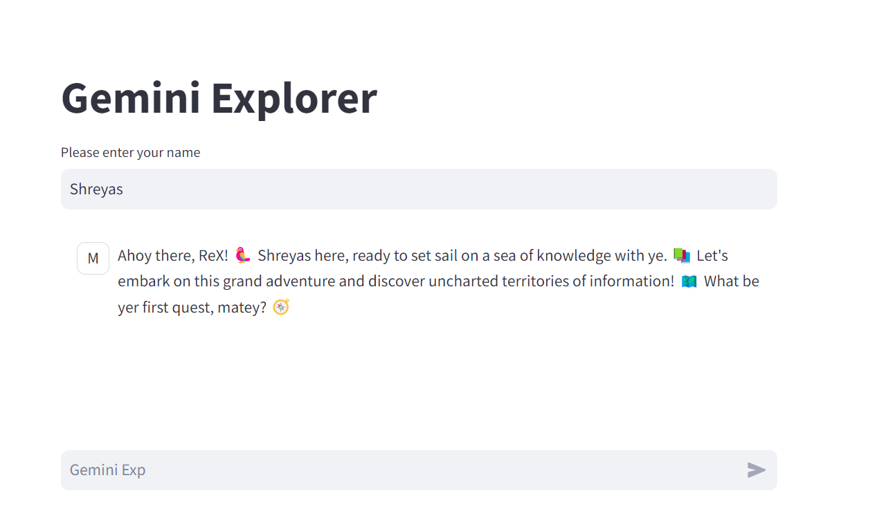
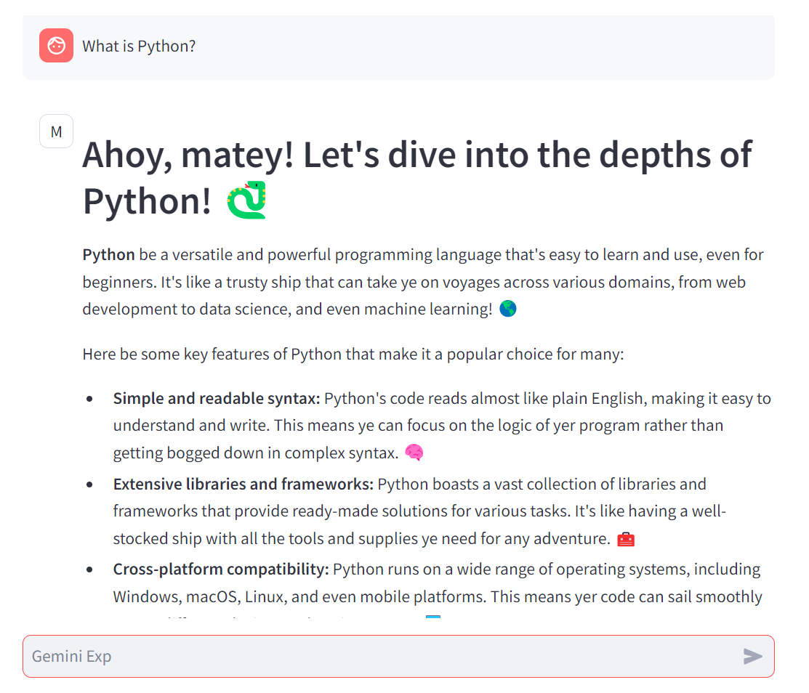

# Gemini-explorer

# Description

An interactive Streamlit app powered by Google Gemini for engaging AI-assisted conversations. Users can input their names and queries to receive dynamic responses. The app maintains chat history and provides a seamless user experience with a fun, emoji-enhanced interface

# Task 1

### Steps to Set Up Google Cloud for Gemini Explorer Mission

1. **Create a Google Cloud Account:**

   - Go to [Google Cloud Platform](https://cloud.google.com/).
   - Sign up for a new account or log in.
   - Verify your account with billing information (no charges initially).

2. **Set Up Billing:**

   - Ensure billing information is accurate for account verification.
   - Utilize free trial credits. Upgrade to a paid account after the trial or credits end to continue using services.

3. **Create a Project for Gemini Explorer Mission:**
   - In the Google Cloud Platform dashboard, create a new project.
   - Name the project descriptively.
   - Go to the Vertex AI section and enable the recommended APIs for your project.

# Task 2

### Steps to Install and Initialize Google Cloud SDK

1. **Install Google Cloud SDK:**

   - Download the installer for your operating system from the [Google Cloud SDK webpage](https://cloud.google.com/sdk/docs/install).
   - Run the installer and follow the prompts to complete the installation.

2. **Initialize Google Cloud SDK:**
   - Open your terminal or command prompt.
   - Run `gcloud init` to start the initialization process.
   - Follow the on-screen instructions to log in to your Google Cloud account and set up your default project and configuration.

# Task 3

### Steps to Set Up Vertex AI in Your Project

1. **Import Required Libraries:**

   ```python
   import vertexai
   import streamlit as st
   from vertexai.preview import generative_models
   from vertexai.preview.generative_models import GenerativeModel, Part, Content, ChatSession
   ```

2. **Initialize Vertex AI:**

   ```python
   project = "gemini-explorer"
   vertexai.init(project=project)
   ```

3. **Load and Start the Model:**
   ```python
   config = generative_models.GenerationConfig(
       temperature=0.4
   )
   model = GenerativeModel(
       "gemini-pro",
       generation_config=config
   )
   chat = model.start_chat()
   ```

# Task 4

### Steps to Run and Test the Streamlit Chat App

1. **Run the Streamlit App:**

   - Open your terminal or IDE.
   - Execute the command: `streamlit run your_app.py`.

2. **Interact with the Chat Interface:**

   - Enter queries related to Gemini Flights in the chat input.
   - Observe the responses displayed in the Streamlit interface.

3. **Observe Responses:**

   - Ensure the app displays both the user's input and the responses from the `llm_function` accurately.
   - Verify that the chat history updates correctly as you interact with the app.

4. **Capture User Input:**
   - Enter a query.
   - Ensure the `llm_function` processes and displays the response correctly in the Streamlit interface.

# Task 5

### Steps to Implement and Personalize ReX in Streamlit App

1. **Implement Initial Prompt:**

   ```python
   if len(st.session_state.messages) == 0:
       initial_prompt = "Introduce yourself as ReX, an assistant powered by Google Gemini. You use emojis to be interactive"
       llm_function(chat, initial_prompt)
   ```

2. **Experiment with Different Prompts:**

   - **Pirate Speak Prompt:**
     ```python
     initial_prompt = "Ahoy! I be ReX, yer assistant powered by Google Gemini. I use emojis to make our chat more fun! 🏴‍☠"
     ```
   - **GenZ Speak Prompt:**
     ```python
     initial_prompt = "Hey there! I'm ReX, your assistant powered by Google Gemini. I use emojis to keep things lit 🔥💯."
     ```

3. **Capture User Information:**

   ```python
   user_name = st.text_input("Please enter your name")
   ```

4. **Personalize ReX's Responses:**

   ```python
   if user_name:
       initial_prompt = f"Ahoy, {user_name}! I be ReX, yer assistant powered by Google Gemini. I use emojis to make our chat more fun! 🏴‍☠"
       llm_function(chat, initial_prompt)
   ```

   After entering your name, you can see the following prompt
   

   You can ask anything you want. For example-
   

Certificate
[Certificate](https://images.bannerbear.com/direct/K6W9Jw1Lro9ZNGDnlo/requests/000/056/844/795/jMVrobL3AQ5dL24L6G9ReqJW5/dfd077d43e6045cf4501e2ff965a30b0d7ae3594.pdf)

**Contributer** -
**Shreyas Waikar**

- [LinkedIn](https://www.linkedin.com/in/connect-with-shreyas-waikar/)
- [GitHub](https://github.com/sdwaikar)
